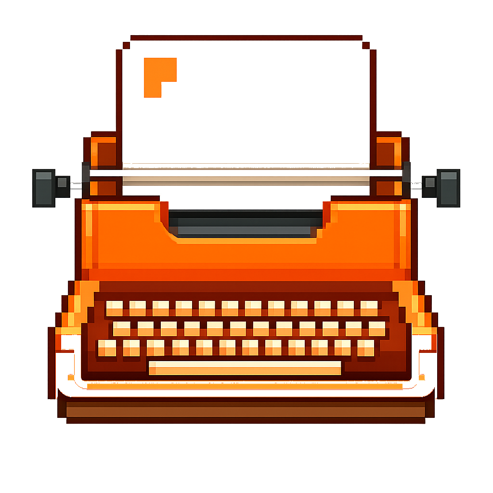

<div align="center">
  
  <h1>Stenographer</h1>
  <p>Turn any audio file into text — no internet, no accounts, no subscriptions. Just press go.</p>
  <a href="https://github.com/feanor08/Stenographer/releases/latest"><strong>⬇️ Download the latest release</strong></a>
</div>

---

## What does it look like?

You get a simple window. Pick your files, choose a quality level, hit **Transcribe**. That's it.

The transcribed text file is saved right next to your original audio file — right where you left it.

---

## Getting started

### macOS

1. Download `Stenographer-x.x.x.dmg` from the [latest release](https://github.com/feanor08/Stenographer/releases/latest)
2. Open the `.dmg` and drag **Stenographer** into **Applications**
3. Right-click → **Open** → **Open** to bypass the Gatekeeper warning (once only)

**Optional — install FFmpeg for time estimates:**
```
brew install ffmpeg
```
> No Homebrew? Run `/bin/bash -c "$(curl -fsSL https://raw.githubusercontent.com/Homebrew/install/HEAD/install.sh)"` first.

---

### Windows

1. Download `Stenographer-x.x.x-windows-x64.zip` from the [latest release](https://github.com/feanor08/Stenographer/releases/latest)
2. Extract the zip anywhere (e.g. `C:\Program Files\Stenographer\`)
3. Double-click **Stenographer.exe** — that's it, no install needed

**Optional — install FFmpeg for time estimates:**
```
winget install Gyan.FFmpeg
```
> No winget? Download from [ffmpeg.org/download.html](https://ffmpeg.org/download.html) and add the `bin\` folder to your PATH.

After installing FFmpeg, **restart Stenographer** so it picks up the new PATH.

---

## How to use it

| Step | What to do |
|------|-----------|
| 1 | Click **Choose Files** (or drag & drop) and pick your audio |
| 2 | Pick a model — not sure? leave it on **medium** |
| 3 | Hit the big **Transcribe** button |
| 4 | The file opens automatically when it's done ✅ |

---

## Which model should I pick?

| Model | Speed | Accuracy | When to use it |
|-------|-------|----------|----------------|
| tiny | ⚡⚡⚡⚡ Very fast | ~60% | Just testing it out |
| base | ⚡⚡⚡ Fast | ~70% | Short clips, clear audio |
| small | ⚡⚡ Fast | ~80% | Everyday recordings |
| **medium** ⭐ | ⚡ Balanced | ~90% | **Best starting point** |
| large-v3 | 🐢 Slow | ~95% | Important recordings, heavy accents |

The app shows how long it'll take **before** you start, so you can decide.

---

## What file types work?

`MP3` · `WAV` · `M4A` · `FLAC` · `AAC` · `OGG` · `WMA` · `MP4` · `MKV`

---

## Does it need wifi?

Only **once** — to download the AI model the first time you use a given quality level.

After that, it works **100% offline**. Your audio never leaves your computer.

---

## Where are logs saved?

| Platform | Location |
|----------|----------|
| macOS | `~/Library/Logs/Stenographer/stenographer.log` |
| Windows | `%LOCALAPPDATA%\Stenographer\Logs\stenographer.log` |
| Linux | `~/.local/share/Stenographer/logs/stenographer.log` |

---

## Tips for best results

- **Clear audio = better results.** Background music or noise will reduce accuracy.
- **Quiet recordings** transcribe much better than ones with lots of echo.
- The app learns from each run and gets better at predicting how long things will take.
